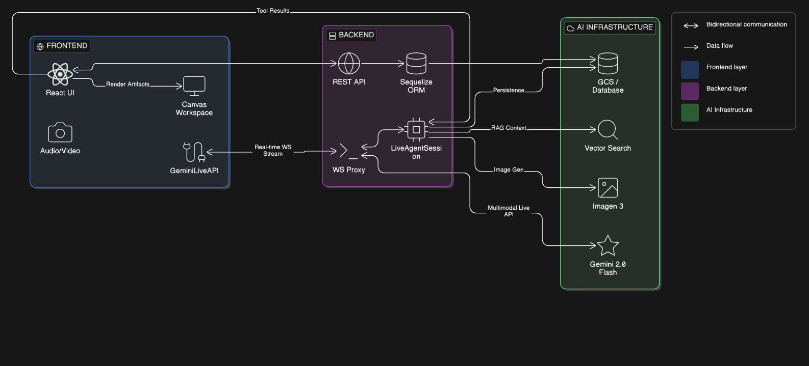

# Horus: The All-Seeing AI Mentor

**Elevator Pitch**
Horus is an intelligent, multiagent AI tutor that meets you exactly where you are. Moving beyond traditional text chats and static file uploads, Horus interacts with you through a real-time video and audio connection—seeing what you see and hearing what you hear. Whether you're sharing your screen to dissect a digital PDF or pointing your camera at a physical notebook, Horus bridges the gap with a true mentor-like approach. By combining natural dialogue with a live canvas for mathematical graphing, dynamic diagrams, and collaborative problem-solving, Horus transforms any subject into an interactive, personalized classroom.

## Inspiration: Bridging the Divide

The spark for **Horus** came from a simple observation: learning is rarely just a text-based conversation. When we study, our hands are working in physical notebooks, our eyes are scanning complex documents, and our minds are trying to visualize abstract concepts. Most AI interfaces are trapped in a "chat box"—disconnected from the physical world and the highly visual nature of education.

Inspired by the ancient Egyptian deity Horus, whose eye represents protection, clarity, and profound insight, we built a platform that "sees" as much as it "thinks." We wanted to create a mentor that could look at a student's handwritten math proof via a live camera feed or analyze a research paper via screen share, and then immediately translate those thoughts into a dynamic, interactive workspace.

## What It Does

Horus operates just like a real-life tutor sitting across the desk from you, utilizing advanced multimodal capabilities to deliver a seamless learning experience:

- **Real-Time Video & Audio Calls:** Say goodbye to typing prompts and uploading photos. You simply jump into a live call with Horus. He processes your live video feed and microphone audio, allowing you to ask questions naturally while pointing at your screen or notebook.
- **Dynamic Visualizations & Graphing:** Learning is a visual process. Whenever a concept gets complicated, Horus can instantly draw mathematical graphs, map out complex data, or generate custom images to make abstract ideas concrete and easy to grasp.
- **Interactive Learning Canvas:** Horus doesn't just tell you the answer; he shows you the work. Using a shared digital canvas, Horus can visually summarize entire topics with custom diagrams, break down equations step-by-step, and collaborate with you to solve complex problems in real-time.
- **Context-Aware Mentorship:** Because Horus can see your physical workspace and hear your tone, he adapts his teaching style to your specific context, guiding your curiosity rather than just spitting out robotic facts.

## 🛠️ Getting Started

Follow these instructions to set up Horus on your local machine.

### Prerequisites
- **Node.js**: v18+ recommended.
- **NPM**: or Yarn/PNPM.
- **Google Cloud Account**: For Vertex AI, Vector Search, and GCS.
- **CockroachDB**: Serverless account (or localized PostgreSQL).

### 1. Installation

Clone the repository and install dependencies for both the frontend and backend.

```bash
# Install Backend Dependencies
cd agent_server
npm install

# Install Frontend Dependencies
cd ../agent_front
npm install
```

### 2. Environment Configuration

#### Backend (`agent_server`)
1. Create a `.env` file in the `agent_server` directory by copying `.env.example`.
2. Populate the following critical variables:
   - `SECRET_KEY`: Your JWT secret.
   - `DATABASE_URL`: Connection string for your CockroachDB.
   - `GOOGLE_CLOUD_PROJECT`: Your GCP Project ID.
   - `GCS_BUCKET_NAME`: Bucket for RAG content.
3. **Google Cloud Secrets**:
   - Obtain a Service Account key from GCP with Vertex AI and GCS permissions.
   - Save the key as `secret.json` in the `agent_server` root.
   - Ensure `GOOGLE_APPLICATION_CREDENTIALS` in your `.env` points to `./secret.json`.

#### Frontend (`agent_front`)
1. Create a `.env` file in the `agent_front` directory.
2. Add the backend API URL:
   ```env
   VITE_API_URL=http://localhost:3000
   ```

### 3. Running the Application

```bash
# Start Backend (from agent_server)
npm run dev

# Start Frontend (from agent_front)
npm run dev
```

## 🚀 How to Use

Follow these steps to start your learning journey with Horus:

### 1. User Authentication
- **Google OAuth**: Sign in instantly using your Google account for a seamless experience.
- **Email & OTP**: Alternatively, register/login with your email address. Horus will send a **One-Time Password (OTP)** to your inbox to verify your identity.
- **Persistence**: Authentication ensures your session history and knowledge base are securely saved across devices.

### 2. Multimedia Support (Files & Images)
- **Upload**: In the **Standard Chat** mode, use the attachment icon to upload PDFs, text files, or images (JPG/PNG).
- **Processing**: Once uploaded, you can ask Horus to summarize documents, explain diagrams in images, or extract key data from your files.

### 2. Choose Your Interaction Mode
Horus supports two ways of communicating:
- **Standard Chat (HTTP/SSE)**: Use the main chat interface for text-based questions and file attachments. This uses Server-Sent Events (SSE) for a smooth, streaming text experience.
- **Live Mentor (WebSocket/Socket)**: Navigate to the **Socket** page for the "All-Seeing" mentor experience. This mode enables low-latency voice and vision.

### 3. Start a Live Session (Socket Mode)
- Navigate to the **Socket** page.
- Click the **Connect** button in the top-right corner.
- Once connected, you'll see a green "CONNECTED" status.

### 4. Live Interaction (Voice & Vision)
- **Voice**: Click the **🎙️ Live** button to unmute your microphone.
- **Vision**: Use the **📷 Cam** or **🖥️ Screen** buttons to share your visual context (e.g., your notebook or a PDF).
- **Audio Output**: Horus will respond with real-time audio. Ensure your sound is enabled.

### 5. Using the Interactive Canvas
- Whenever Horus explains a complex concept (in either mode), he will trigger the **Canvas Workspace**.
- **Math Visualization**: Interactive graphs and plots via `Mafs`.
- **Diagrams**: Logic flows and architecture via `Mermaid.js`.
- **Image Generation**: Custom educational images generated via `Imagen 3`.
- **Markdown Notes**: Step-by-step notes and quizzes.

### 6. Knowledge Base & History
- Use the **Sidebar** to review past sessions.
- Open the **Knowledge Base** (KB) to upload documents that Horus should reference during your study sessions.

## 💡 Example Prompts

Not sure what to ask? Try these prompts to see Horus in action:

- **Mathematics**: "Look at this calculus problem in my notebook [shares camera]. Can you explain the steps to solve it and plot the derivative on the canvas?"
- **Document Analysis**: [Uploads a PDF] "Can you summarize the key findings of this research paper and list the most important citations?"
- **Visual Reasoning**: [Uploads an image] "Explain the circuit diagram in this photo and tell me if the connections look correct."
- **Computer Science**: "Explain the difference between Microservices and Monolithic architectures. Please draw a comparison diagram on the canvas."
- **Study Aid (RAG)**: "I've uploaded my lecture notes. Can you summarize the key concepts of Chapter 3 and create a 5-question quiz for me?"
- **Visual Learning**: "I'm having trouble visualizing a black hole's event horizon. Can you generate an image to show its structure?"
- **Collaborative Writing**: "Let's outline a research paper on AI Ethics. Use the canvas to keep a structured list of our main arguments."

## Horus Tech Stack: Detailed Architecture



Horus is built on a modern, multimodal "AI-Native" stack designed for high-performance tutoring and real-time visual collaboration.

### 🏗️ Core Architecture

- **Frontend**: React (v19) + Vite (v7)
- **Backend**: Node.js + Express (v5.x)
- **Database**: CockroachDB (Serverless / PostgreSQL-compatible)
- **ORM**: Sequelize

### 🤖 AI & Machine Learning (Vertex AI)

The project leverages the **Google Cloud Vertex AI** ecosystem for its "All-Seeing" capabilities:

- **Primary Model**: `gemini-2.0-flash-exp` (Implied by current state-of-the-art multimodal usage)
- **Multimodal Integration**: Native support for live video streams and camera feeds via Vertex AI's multimodal live API.
- **RAG (Retrieval-Augmented Generation)**:
  - **Embeddings**: `text-multilingual-embedding-002` (standard for RAG).
  - **Vector Storage**: **Vertex AI Vector Search** for ultra-low latency semantic retrieval.
- **Storage**: **Google Cloud Storage (GCS)** for persistent storage of indexed document chunks.

### 🎨 Frontend & Visualization Workspace

The "Canvas" workspace uses specialized libraries to render complex data:

- **Math Visualization**: **Mafs** (`mafs`) – used for rendering interactive SVG-based coordinate geometry and plots.
- **Diagramming**: **Mermaid.js** (`mermaid`) – used for architecture diagrams, flowcharts, and sequence diagrams.
- **Styling**: **Tailwind CSS** (v4.0) – modern utility-first CSS.
- **State Management**: React Hooks (native) + Context API for session and theme management.

### 🔌 Integrations & Infrastructure

- **Authentication**: **Google OAuth 2.0** for seamless student login.
- **Email Service**: **Nodemailer** – configured via SMTP for notifications and verification.
- **Real-time Communication**: **WebSockets** (`ws`) – used for the proxy layer that handles live tutor sessions.
- **Environment**: **Docker** for consistent development and deployment environments.
- **Cloud Hosting**: **Google Cloud Platform (GCP)** (us-central1) for AI, Storage, and Vector services.
- **CI/CD Pipeline**: **GitHub Actions** – automated testing, linting, and deployment to GCP using Docker images.

### 🔐 Infrastructure Notes

- **Region**: us-central1 (AI) and europe-west3 (Database).
- **Database Engine**: PostgreSQL wire protocol over CockroachDB.

## 🛠️ Challenges Faced: The "Sync" Problem

One of our greatest hurdles was **Asynchronous Synchronization**. When an AI is "thinking" and streaming a live response, how do you make sure a complex visualization (like a graph) appears at the _exact_ moment the tutor mentions it?
We solved this by developing a custom **Markdown-Lite Parser** that identifies "Artifact Trigger Tags" in the stream and hydrates the Canvas component without breaking the flow of the conversation.

Another challenge was **Multimodal Context Switching**. Teaching a student to solve a derivative:
$$\frac{d}{dx}(x^n) = nx^{n-1}$$
Requires the AI to "look" at the student's starting point (camera/PDF) while simultaneously generating a visual proof on the canvas. Fine-tuning the prompt instructions to handle this multi-step visual reasoning was a game of extreme precision.

## 📚 What We Learned

This project taught us that **Context is King**. An AI tutor is only as good as the world it can perceive. By enabling Horus to share the student's screen and see their camera, we moved from "AI as a tool" to "AI as a partner."

We learned that the future of education isn't just about faster answers—it's about richer visualizations and more empathetic companionship.

## What's Next for Horus

We have built a strong multimodal foundation, but our roadmap for scaling Horus into a global educational platform includes:

- **React Native Mobile App:** We plan to take Horus on the go by building a native mobile client. This will allow students to seamlessly use their phone cameras to capture physical whiteboards, textbooks, or study groups in real-time, completely untethering the AI tutor from the desktop.
- **Multiplayer AI Classrooms:** Learning shouldn't happen in isolation. We are developing a feature where you and your friends can open a shared, live meeting with Horus. The AI will act as the ultimate co-host, listening to the group's discussion, answering questions for everyone, and updating a shared visual canvas that the whole group can interact with.
- **Global CDN & Live Streaming Architecture:** To support high-quality multiplayer sessions, we will upgrade our infrastructure to include a robust Content Delivery Network (CDN) and advanced live video streaming protocols. This ensures ultra-low latency audio and visual syncing, giving study groups a smooth, buffer-free real-time experience no matter where they are located.
- **Dynamic 3D Textures and Diagrams:** Using Three.js, we will also enable students to create interactive 3D diagrams and textures that can be shared and discussed in real-time. This will allow students to visualize complex concepts in a more engaging and interactive way, further enhancing their understanding and retention of the material.
